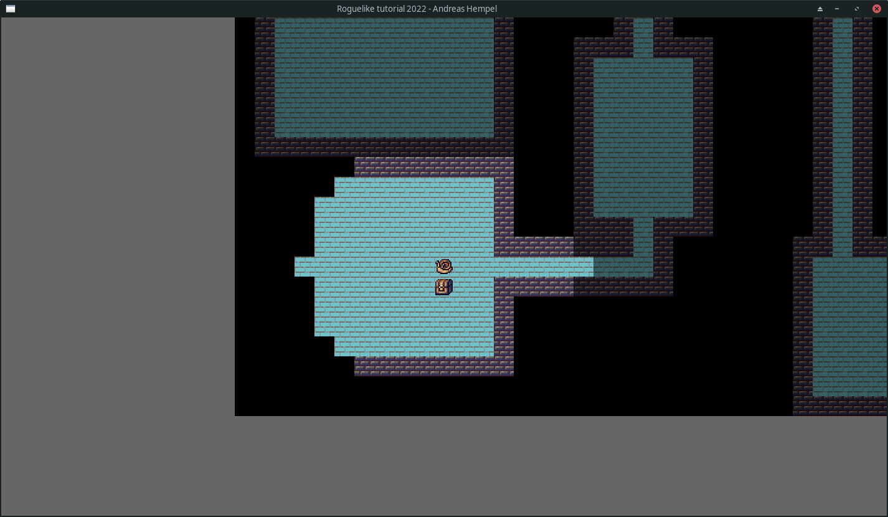

# Complete Roguelike Tutorial 2022

An attempt at building a basic but complete roguelike in Rust using the [Bevy](https://bevyengine.org/) game engine as part of the 2022 version of the 'complete roguelike challenge' on [r/roguelikedev](www.reddit.com/r/roguelikedev). Progress is loosely based on the 2021 version of the [libtcod tutorial](https://rogueliketutorials.com/tutorials/tcod/v2/) with further inspiration drawn from the extensive and excellent [Hands on Rust roguelike tutorial](http://bfnightly.bracketproductions.com/rustbook/). My goals with this project are to
- complete the challenge (implement all the basic building blocks of a roguelike described in the libtcod tutorial),
- learn more about games programming, Rust, and Bevy,
- publish this as an open-source project, and
- have fun!

## Fundamental design decisions

The foremost goal is to complete the challenge which means I will try to stick to basic, fundamental features. I will need to remind myself repeatedly to not get lost in some cool extra feature or fancy implementation. Hence, the first version of this will be a tile-based, 2D roguelike with turn-based actions. That said, I will diverge from the `libtcod` tutorial in a few major ways:
- Using **sprites instead of ASCII** / console graphics - I prefer (marginally) nicer aesthetics and want to learn working with sprites.
- Using **Bevy's ECS** (Entity, Components, Systems) implementation instead of rolling my own game loop - I want to learn ECS-based games programming (although I realize it may not be a great fit for a turn-based game).
- Using **Rust instead of Python** - because I prefer strongly-typed languages and Rust is fun!

Further decisions taken while working on the game:
- Experiment with a **combatless design** - NPCs will not fight the player but rather serve as mobile obstacles, potentially throwing other wrenches their way, e.g. having the player skip turns. This decision is primarily driven by my four year old son being interested in what I am doing. I want him to be able to thoroughly enjoy the game and play around with it without having to worry about child-appropriate absence or representations of combat. I am considering adding a countdown mechanic instead where the goal is to reach a treasure chest in a level before a time runs out. Instead of combat-focused abilities, spells can serve exploration (clairvoyance), mobility (teleport), or tactical (push hindering monsters out of the way) goals. 

## State of the game

This initial implementation has the following "features":
- Build a map made up of room and corridors or based on cellular automata (selectable via CLI parameter)
- Spawn a player on the screen and llow the player to move around using arrow keys
- Field of vision computation based on symmetric shadow casting
- Spawn a limited number of monsters on the map and have them wander across the map randomly
- Spawn a single treasure chest per map
- Monsters may be pushed out of the way as a simple substitute for combat

This encompasses the core features up to and including part 5 (sans the 'melee combat' part) of the [`libtcod` tutorial](https://rogueliketutorials.com/tutorials/tcod/v2/part-5/).

# Attributions and thanks

This repository includes the "Dawnlike Universal Rogue-like tileset v1.81" by [DragonDPlatino](https://opengameart.org/users/dragondeplatino) (inside the `assets/Dawnlike` subfolder) which is inspired by `DawnBringer` and their work on color palettes. That is my understanding at least, I am not familiar with their previous work. But I appreciate both of their contributions very much since this means I have a very comprehensive tileset to use for this project. It can be found on [Open Game Art](https://opengameart.org/content/dawnlike-16x16-universal-rogue-like-tileset-v181) where it is shared under a CC-BY 4.0 license. I will be adding an obscure way to summon the `Platino` sprite to the game as I progress through the tutorial.

Massive thanks to
- [Carter Anderson (cart)](https://github.com/cart) for sharing the awesome [Bevy](https://bevyengine.org/) game engine (available [on Github]((https://github.com/bevyengine/bevy))) with the Rust community
- [Herbert Wolverson](https://bracketproductions.com/) for writing the monstrously comprehensive [Rust Roguelike Tutorial](http://bfnightly.bracketproductions.com/rustbook/) which I have been using as inspiration and guidance despite opting for another engine
- [Amit Patel](https://www.reddit.com/user/redblobgames/) of [Red Blob Games](https://www.redblobgames.com/) for awesome and instructive visualizations of many common algorithms and procedural generation techniques which are an inspiration and great help

# License

This Rogulike Tutorial project is dual-licensed under either

* MIT License (LICENSE-MIT or http://opensource.org/licenses/MIT)
* Apache License, Version 2.0 (LICENSE-APACHE or http://www.apache.org/licenses/LICENSE-2.0)

at your option.
